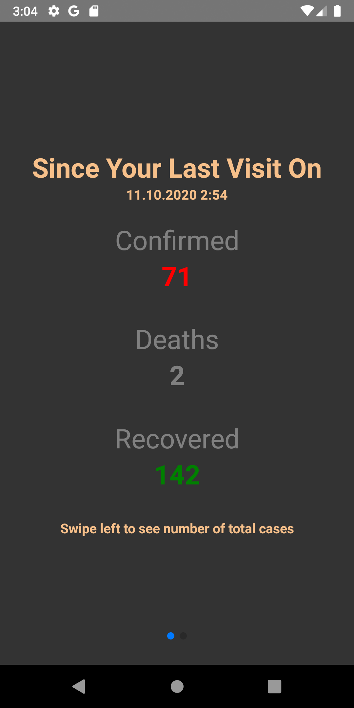
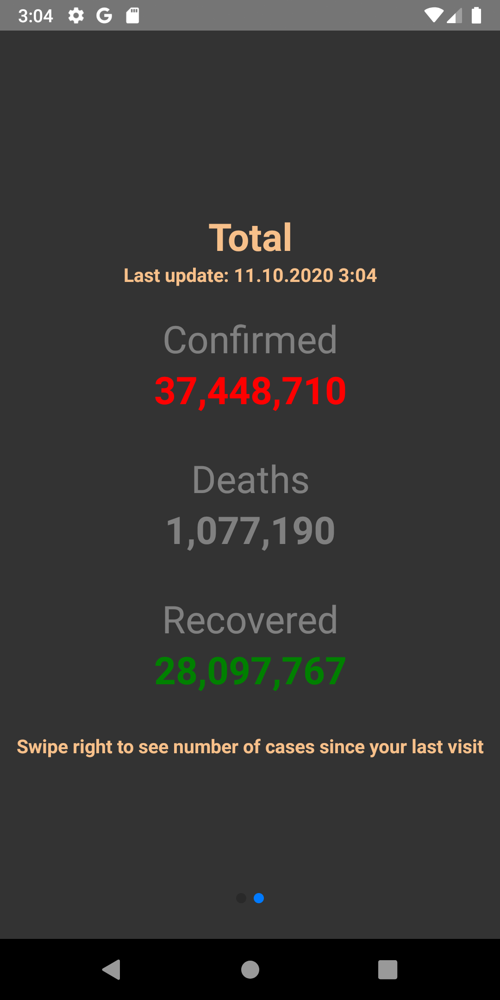

# Covid19 Case Updates Tracker

## To run

- `npm install`
- Start your emulator or plug in your physical device
- `npm run start`
- `npm run android` or `npm run ios`

## Screenshots

  
  

## Notes
It hasn't been tested on ios